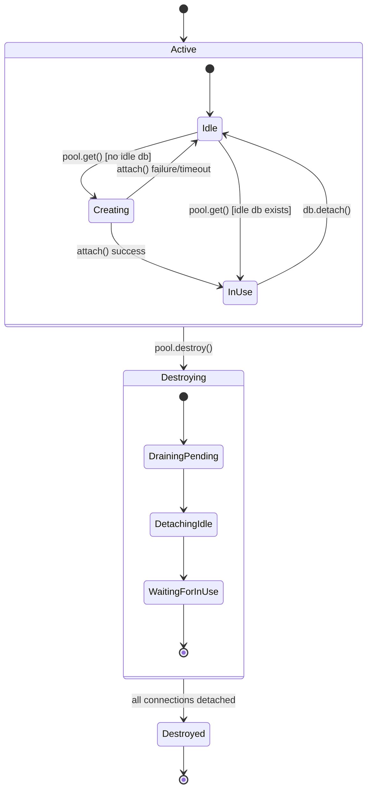
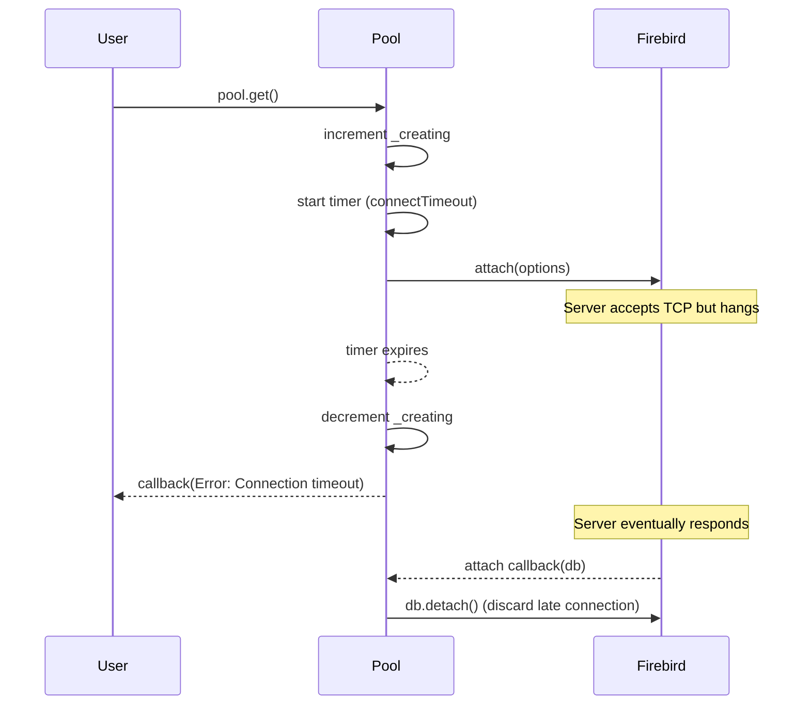

# Pure JavaScript and Asynchronous Firebird client for Node.js


[![NPM version][npm-version-image]][npm-url] [![NPM downloads][npm-downloads-image]][npm-url] [![Mozilla License][license-image]][license-url]

[](https://nodei.co/npm/node-firebird/)

[Firebird forum](https://groups.google.com/forum/#!forum/node-firebird) on Google Groups.

## Firebird database on social networks

- [Firebird on Twitter](https://twitter.com/firebirdsql/)
- [Firebird on Facebook](https://www.facebook.com/FirebirdSQL)

## Changelog for version v0.2.x

- added auto-reconnect
- added [sequentially selects](https://github.com/hgourvest/node-firebird/wiki/What-is-sequentially-selects)
- events for connection (attach, detach, row, result, transaction, commit, rollback, error, etc.)
- performance improvements
- supports inserting/updating buffers and streams
- reading blobs (sequentially)
- pooling
- `database.detach()` waits for last command
- better unit-test

---

- [Firebird documentation](https://firebirdsql.org/en/documentation/)
- [Firebird limits and data types](https://firebirdsql.org/en/firebird-technical-specifications/)

## Installation

```bash
npm install node-firebird
```

## Usage

```js
var Firebird = require('node-firebird');
```

### Methods

- `Firebird.escape(value) -> return {String}` - prevent for SQL Injections
- `Firebird.attach(options, function(err, db))` attach a database
- `Firebird.create(options, function(err, db))` create a database
- `Firebird.attachOrCreate(options, function(err, db))` attach or create database
- `Firebird.pool(max, options) -> return {Object}` create a connection pooling

## Connection types

### Connection options

```js
var options = {};

options.host = '127.0.0.1';
options.port = 3050;
options.database = 'database.fdb';
options.user = 'SYSDBA';
options.password = 'masterkey';
options.lowercase_keys = false; // set to true to lowercase keys
options.role = null; // default
options.pageSize = 4096; // default when creating database
options.retryConnectionInterval = 1000; // reconnect interval in case of connection drop
options.blobAsText = false; // set to true to get blob as text, only affects blob subtype 1
options.blobChunkSize = 1024; // segment size in bytes used when WRITING blobs (default 1024, max 65535)
options.blobReadChunkSize = 1024; // buffer size in bytes requested per op_get_segment when READING blobs (default 1024, max 65535)
options.encoding = 'UTF8'; // default encoding for connection is UTF-8
options.wireCompression = false; // set to true to enable firebird compression on the wire (works only on FB >= 3 and compression is enabled on server (WireCompression = true in firebird.conf))
options.wireCrypt = Firebird.WIRE_CRYPT_ENABLE; // default; set to Firebird.WIRE_CRYPT_DISABLE to disable wire encryption (FB >= 3)
options.pluginName = undefined; // optional, auto-negotiated; can be set to Firebird.AUTH_PLUGIN_SRP256, Firebird.AUTH_PLUGIN_SRP, or Firebird.AUTH_PLUGIN_LEGACY
options.dbCryptConfig = undefined; // optional; database encryption key for encrypted databases. Use 'base64:<value>' for base64-encoded keys or plain text
options.connectTimeout = 10000; // optional; timeout in ms for a single pool.get() attach operation (default: no timeout)
options.parallelWorkers = undefined; // optional; request multiple thread workers for maintenance/index tasks (FB >= 5)
options.maxInlineBlobSize = undefined; // optional; threshold size in bytes for inline blob transmission (default 65535, FB >= 5.0.3)
options.maxNegotiatedProtocols = 10; // optional; limit maximum protocol versions negotiated (default 10 for compatibility, set to 11 for FB >= 6.0)
options.defaultSchema = undefined; // optional; sets session CURRENT_SCHEMA at connect time (FB >= 6.0)
options.searchPath = undefined; // optional; ordered list/array of schemas to resolve unqualified object references (FB >= 6.0)
options.jsonAsObject = false; // optional; automatically stringify parameters and parse query results that contain JSON (FB >= 6.0)
```

### Classic

```js
Firebird.attach(options, function (err, db) {
  if (err) throw err;

  // db = DATABASE
  db.query('SELECT * FROM TABLE', function (err, result) {
    // IMPORTANT: close the connection
    db.detach();
  });
});
```

### Pooling

```js
// 5 = the number is count of opened sockets
var pool = Firebird.pool(5, options);

// Get a free pool
pool.get(function (err, db) {
  if (err) throw err;

  // db = DATABASE
  db.query('SELECT * FROM TABLE', function (err, result) {
    // IMPORTANT: release the pool connection
    db.detach();
  });
});

// Destroy pool
pool.destroy();
```

#### Advanced Pooling Features

The pool implementation includes several safeguards for reliability:

1.  **Connection Timeout**: Use `options.connectTimeout` to prevent the pool from hanging if a server accepts the TCP connection but fails to respond to the Firebird wire protocol (e.g., during high load or authentication stalls).
2.  **Pool Destruction**: Calling `pool.destroy()` now immediately drains the `pending` queue, notifying all waiting callers with an error. It also prevents any further `pool.get()` calls.
3.  **Slot Recovery**: If a connection attempt times out, the pool slot is correctly freed so subsequent requests can be served. Late-arriving connections are automatically discarded to prevent resource leaks.

#### Pool Lifecycle State Diagram



#### Connect Timeout Sequence



## Database object (db)

### Database Methods

- `db.query(query, [params], function(err, result), options)` - classic query, returns Array of Object
- `db.execute(query, [params], function(err, result), options)` - classic query, returns Array of Array
- `db.sequentially(query, [params], function(row, index), function(err), options)` - sequentially query
- `db.detach(function(err))` detach a database
- `db.transaction(options, function(err, transaction))` create transaction
- `db.createTablespace(name, filePath, function(err, result))` - Create a physical tablespace (FB >= 6.0)
- `db.alterTablespace(name, filePath, function(err, result))` - Alter an existing tablespace physical location (FB >= 6.0)
- `db.dropTablespace(name, function(err, result))` - Drop a tablespace (FB >= 6.0)
- `db.createSchema(schemaName, [tablespaceName], function(err, result))` - Create a schema/namespace, optionally binding it to a tablespace (FB >= 6.0)

### Transaction options

```js
const options = {
    autoCommit: false,
    autoUndo: true,
    isolation: Firebird.ISOLATION_READ_COMMITTED,
    ignoreLimbo: false,
    readOnly: false,
    wait: true,
    waitTimeout: 0,
};
```

### Transaction methods

- `transaction.query(query, [params], function(err, result), options)` - classic query, returns Array of Object
- `transaction.execute(query, [params], function(err, result), options)` - classic query, returns Array of Array
- `transaction.sequentially(query, [params], function(row, index), function(err), options)` - sequentially query
- `transaction.commit(function(err))` commit current transaction
- `transaction.rollback(function(err))` rollback current transaction

### Statement options 

```js
const options = {
  timeout: 1000, // Statement timeout in ms, default is 0 (no timeout)
}
```

## Examples

### Parametrized Queries

### Parameters

```js
Firebird.attach(options, function (err, db) {
  if (err) throw err;

  // db = DATABASE
  db.query(
    'INSERT INTO USERS (ID, ALIAS, CREATED) VALUES(?, ?, ?) RETURNING ID',
    [1, "Pe'ter", new Date()],
    function (err, result) {
      console.log(result[0].id);
      db.query(
        'SELECT * FROM USERS WHERE Alias=?',
        ['Peter'],
        function (err, result) {
          console.log(result);
          db.detach();
        }
      );
    }
  );
});
```

### Tablespaces and Schema Partitioning (Firebird 6.0+)

For Firebird 6.0+ (Protocol 20+), you can create and manage physical tablespace locations and logical schema namespaces, optionally partitioning schemas into specific physical tablespaces.

```js
Firebird.attach(options, function (err, db) {
  if (err) throw err;

  // 1. Create a physical tablespace mapping to a physical storage location
  db.createTablespace('FAST_TS', '/ssd/fast_data.ts', function (err, result) {
    if (err) throw err;
    console.log('Tablespace FAST_TS created successfully');

    // 2. Create a schema namespace and partition it into the FAST_TS tablespace
    db.createSchema('MYSCHEMA', 'FAST_TS', function (err, result) {
      if (err) throw err;
      console.log('Schema MYSCHEMA partitioned to FAST_TS');

      // 3. Drop tablespace when no longer needed
      // db.dropTablespace('FAST_TS', function (err, result) { ... });

      db.detach();
    });
  });
});
```

### Native JSON Data Type Support (Firebird 6.0+)

By enabling the `jsonAsObject` connection parameter, the driver will automatically serialize JavaScript objects/arrays passed as query parameters to JSON strings, and automatically parse returned JSON text/BLOB columns back into JavaScript objects/arrays.

```js
const options = {
    // ...other connection options
    jsonAsObject: true,
    blobAsText: true  // recommended to read text BLOBs as strings
};

Firebird.attach(options, function (err, db) {
  if (err) throw err;

  const data = { name: 'Alice', age: 30, roles: ['admin', 'user'] };

  db.query(
    'INSERT INTO USERS (ID, PROFILE_JSON) VALUES (?, ?)',
    [1, data],
    function (err, result) {
      if (err) throw err;

      db.query(
        'SELECT PROFILE_JSON FROM USERS WHERE ID = ?',
        [1],
        function (err, result) {
          if (err) throw err;
          // PROFILE_JSON is automatically parsed back to a JavaScript object
          console.log(result[0].profile_json); // { name: 'Alice', age: 30, roles: ['admin', 'user'] }
          db.detach();
        }
      );
    }
  );
});
```

### SQL-Standard ROW Type (Firebird 6.0+)

Firebird 6.0+ supports the SQL-standard `ROW` type representing composite records / tuples (e.g. `ROW(id INT, name VARCHAR(20))`). Since the database server compiles row value expressions into individual scalar columns/parameters at the wire interface, you can pass individual parameters or tuple arrays natively:

```js
Firebird.attach(options, function (err, db) {
  if (err) throw err;

  // Use a row value expression / tuple comparison
  db.query(
    'SELECT * FROM USERS WHERE (ID, NAME) = (ROW(?, ?))',
    [1, 'Alice'],
    function (err, rows) {
      if (err) throw err;
      console.log(rows);
      db.detach();
    }
  );
});
```

For PSQL block declarations (triggers, procedures), you can declare and use `ROW`/`RECORD` variables (such as `DECLARE VARIABLE myrow ROW(id INT, name VARCHAR(20))`) directly within the compiled SQL strings executed via `db.query` or `db.execute`.

### BLOB (stream)

```js
Firebird.attach(options, function (err, db) {
  if (err) throw err;

  // db = DATABASE
  // INSERT STREAM as BLOB
  db.query(
    'INSERT INTO USERS (ID, ALIAS, FILE) VALUES(?, ?, ?)',
    [1, 'Peter', fs.createReadStream('/users/image.jpg')],
    function (err, result) {
      // IMPORTANT: close the connection
      db.detach();
    }
  );
});
```

### BLOB (buffer)

```js
Firebird.attach(options, function (err, db) {
  if (err) throw err;

  // db = DATABASE
  // INSERT BUFFER as BLOB
  db.query(
    'INSERT INTO USERS (ID, ALIAS, FILE) VALUES(?, ?, ?)',
    [1, 'Peter', fs.readFileSync('/users/image.jpg')],
    function (err, result) {
      // IMPORTANT: close the connection
      db.detach();
    }
  );
});
```

### Reading Blobs (Asynchronous)

```js
Firebird.attach(options, function (err, db) {
  if (err) throw err;

  // db = DATABASE
  db.query('SELECT ID, ALIAS, USERPICTURE FROM USER', function (err, rows) {
    if (err) throw err;

    // first row
    rows[0].userpicture(function (err, name, e) {
      if (err) throw err;

      // +v0.2.4
      // e.pipe(writeStream/Response);

      // e === EventEmitter
      e.on('data', function (chunk) {
        // reading data
      });

      e.on('end', function () {
        // end reading
        // IMPORTANT: close the connection
        db.detach();
      });
    });
  });
});
```

### Reading Multiples Blobs (Asynchronous)

```js
Firebird.attach(options, (err, db) => {
  if (err) throw err;

  db.transaction(Firebird.ISOLATION_READ_COMMITTED, (err, transaction) => {
    if (err) {
      throw err;
    }

    transaction.query('SELECT FIRST 10 * FROM JOB', (err, result) => {
      if (err) {
        transaction.rollback();
        return;
      }

      const arrBlob = [];
      for (const item of result) {
        const fields = Object.keys(item);
        for (const key of fields) {
          if (typeof item[key] === 'function') {
            item[key] = new Promise((resolve, reject) => {
              // the same transaction is used (better performance)
              // this is optional
              item[key](transaction, (error, name, event, row) => {
                if (error) {
                  return reject(error);
                }

                // reading data
                let value = '';
                event.on('data', (chunk) => {
                  value += chunk.toString('binary');
                });
                event.on('end', () => {
                  resolve({ value, column: name, row });
                });
              });
            });
            arrBlob.push(item[key]);
          }
        }
      }

      Promise.all(arrBlob)
        .then((blobs) => {
          for (const blob of blobs) {
            result[blob.row][blob.column] = blob.value;
          }

          transaction.commit((err) => {
            if (err) {
              transaction.rollback();
              return;
            }

            db.detach();
            console.log(result);
          });
        })
        .catch((err) => {
          transaction.rollback();
        });
    });
  });
});
```

### Optimizing BLOB Read/Write Chunk Sizes

When working with large blobs (especially over remote or high-latency connections), you can configure the chunk/segment sizes to minimize the number of network round-trips:

*   **blobChunkSize**: The segment size in bytes used when writing blobs (default: `1024`, maximum: `65535`).
*   **blobReadChunkSize**: The buffer size in bytes requested per segment read operation when reading blobs (default: `1024`, maximum: `65535`).

For example, setting `blobReadChunkSize: 65535` requests 64KB segments at a time, resulting in up to 64x fewer network packets/round-trips when reading large blobs.

```js
var options = {
    host: '127.0.0.1',
    port: 3050,
    database: 'database.fdb',
    user: 'SYSDBA',
    password: 'masterkey',
    blobChunkSize: 65535,      // Minimize write round-trips
    blobReadChunkSize: 65535   // Minimize read round-trips
};

Firebird.attach(options, function (err, db) {
  if (err) throw err;

  // Insert/Read operations will use the configured 64KB chunk sizes
  db.detach();
});
```

### Streaming a big data

```js
Firebird.attach(options, function (err, db) {
  if (err) throw err;

  // db = DATABASE
  db.sequentially(
    'SELECT * FROM BIGTABLE',
    function (row, index) {
      // EXAMPLE
      stream.write(JSON.stringify(row));
    },
    function (err) {
      // END
      // IMPORTANT: close the connection
      db.detach();
    }
  );
});
```

### Transactions

**Transaction types:**

- `Firebird.ISOLATION_READ_UNCOMMITTED`
- `Firebird.ISOLATION_READ_COMMITTED`
- `Firebird.ISOLATION_REPEATABLE_READ`
- `Firebird.ISOLATION_SERIALIZABLE`
- `Firebird.ISOLATION_READ_COMMITTED_READ_ONLY`

```js
Firebird.attach(options, function (err, db) {
  if (err) throw err;

  // db = DATABASE
  db.transaction(
    Firebird.ISOLATION_READ_COMMITTED,
    function (err, transaction) {
      transaction.query(
        'INSERT INTO users VALUE(?,?)',
        [1, 'Janko'],
        function (err, result) {
          if (err) {
            transaction.rollback();
            return;
          }

          transaction.commit(function (err) {
            if (err) transaction.rollback();
            else db.detach();
          });
        }
      );
    }
  );
});
```

### Driver Events

Driver events are synchronous notifications emitted on the `Database` object for connection-level operations. Subscribe with `db.on(eventName, handler)`.

```js
Firebird.attach(options, function (err, db) {
  if (err) throw err;

  db.on('attach', function () {
    // fired once the database is attached
  });

  db.on('detach', function (isPoolConnection) {
    // isPoolConnection === Boolean
  });

  db.on('reconnect', function () {
    // fired after the driver reconnects a dropped socket
  });

  db.on('error', function (err) {
    // connection-level errors (socket errors, closed connection, etc.)
  });

  db.on('transaction', function (options) {
    // fired when a transaction is started (before server response)
    // options === resolved transaction options object
  });

  db.on('commit', function () {
    // fired when a transaction commit is sent
  });

  db.on('rollback', function () {
    // fired when a transaction rollback is sent
  });

  db.on('query', function (sql) {
    // fired with the SQL string when a statement is prepared
  });

  db.on('row', function (row, index, isObject) {
    // fired for each row decoded during a fetch
    // index === Number, isObject === Boolean
  });

  db.on('result', function (rows) {
    // fired with the full rows array once all rows are fetched
    // rows === Array
  });

  db.detach();
});
```

### Firebird Database Events (POST_EVENT)

Firebird database events are **asynchronous** notifications triggered by `POST_EVENT` inside PSQL triggers or stored procedures. They travel over a separate aux connection and are handled through `FbEventManager`.

> **Note:** Full POST_EVENT reception is not yet implemented. `attachEvent` and `registerEvent` are available, but actual event delivery requires completing the `op_que_events`/`op_event` wire-protocol implementation.

```js
Firebird.attach(options, function (err, db) {
  if (err) throw err;

  // 1. Open the aux event connection and get a FbEventManager
  db.attachEvent(function (err, evtmgr) {
    if (err) throw err;

    // 2. Subscribe to one or more named events
    evtmgr.registerEvent(['MY_EVENT'], function (err) {
      if (err) throw err;

      // 3. Listen for POST_EVENT notifications
      evtmgr.on('post_event', function (name, count) {
        // name  === event name string (e.g. 'MY_EVENT')
        // count === cumulative trigger count since last notification
      });
    });

    // 4. Unsubscribe from events when no longer needed
    // evtmgr.unregisterEvent(['MY_EVENT'], function (err) { ... });

    // 5. Release the aux connection when done
    // evtmgr.close(function (err) { ... });
  });
});
```

### Escaping Query values

```js
var sql1 = 'SELECT * FROM TBL_USER WHERE ID>' + Firebird.escape(1);
var sql2 = 'SELECT * FROM TBL_USER WHERE NAME=' + Firebird.escape("Pe'er");
var sql3 =
  'SELECT * FROM TBL_USER WHERE CREATED<=' + Firebird.escape(new Date());
var sql4 = 'SELECT * FROM TBL_USER WHERE NEWSLETTER=' + Firebird.escape(true);

// or db.escape()

console.log(sql1);
console.log(sql2);
console.log(sql3);
console.log(sql4);
```

### Using GDS codes

```js
var { GDSCode } = require('node-firebird/lib/gdscodes');
/*...*/
db.query(
  'insert into my_table(id, name) values (?, ?)',
  [1, 'John Doe'],
  function (err) {
    if (err.gdscode == GDSCode.UNIQUE_KEY_VIOLATION) {
      console.log('constraint name:' + err.gdsparams[0]);
      console.log('table name:' + err.gdsparams[0]);
      /*...*/
    }
    /*...*/
  }
);
```

### Service Manager functions

- backup
- restore
- fixproperties
- serverinfo
- database validation
- commit transaction
- rollback transaction
- recover transaction
- database stats
- users infos
- user actions (add modify remove)
- get firebird file log
- tracing

```js
// each row : fctname : [params], typeofreturn
var fbsvc = {
    "backup" : { [ "options"], "stream" },
    "nbackup" : { [ "options"], "stream" },
    "restore" : { [ "options"], "stream" },
    "nrestore" : { [ "options"], "stream" },
    "setDialect": { [ "database","dialect"], "stream" },
    "setSweepinterval": { [ "database","sweepinterval"], "stream" },
    "setCachebuffer" : { [ "database","nbpagebuffers"], "stream" },
    "BringOnline" : { [ "database"], "stream" },
    "Shutdown" : { [ "database","shutdown","shutdowndelay","shutdownmode"], "stream" },
    "setShadow" : { [ "database","activateshadow"], "stream" },
    "setForcewrite" : { [ "database","forcewrite"], "stream" },
    "setReservespace" : { [ "database","reservespace"], "stream" },
    "setReadonlyMode" : { [ "database"], "stream" },
    "setReadwriteMode" : { [ "database"], "stream" },
    "validate" : { [ "options"], "stream" },
    "commit" : { [ "database", "transactid"], "stream" },
    "rollback" : { [ "database", "transactid"], "stream" },
    "recover" : { [ "database", "transactid"], "stream" },
    "getStats" : { [ "options"], "stream" },
    "getLog" : { [ "options"], "stream" },
    "getUsers" : { [ "username"], "object" },
    "addUser" : { [ "username", "password", "options"], "stream" },
    "editUser" : { [ "username", "options"], "stream" },
    "removeUser" : { [ "username","rolename"], "stream" },
    "getFbserverInfos" : { [ "options", "options"], "object" },
    "startTrace" : { [ "options"], "stream" },
    "suspendTrace" : { [ "options"], "stream" },
    "resumeTrace" : { [ "options"], "stream" },
    "stopTrace" : { [ "options"], "stream" },
    "getTraceList" : { [ "options"], "stream" },
    "hasActionRunning" : { [ "options"], "object"}
}

```

### Backup Service example

```js
const options = {...}; // Classic configuration with manager = true
Firebird.attach(options, function(err, svc) {
    if (err)
        return;
    svc.backup(
        {
            database:'/DB/MYDB.FDB',
            files: [
                    {
                     filename:'/DB/MYDB.FBK',
                     sizefile:'0'
                    }
                   ]
        },
        function(err, data) {
            data.on('data', line => console.log(line));
            data.on('end', () => svc.detach());
        }
    );
});
```

### Restore Service example

```js
const config = {...}; // Classic configuration with manager = true
const RESTORE_OPTS = {
    database: 'database.fdb',
    files: ['backup.fbk']
};

Firebird.attach(config, (err, srv) => {
    srv.restore(RESTORE_OPTS, (err, data) => {
        data.on('data', () => {});
        data.on('end', () =>{
            srv.detach();})
        });
    });
```

### getLog and getFbserverInfos Service examples with use of stream and object return

```js
fb.attach(_connection, function (err, svc) {
  if (err) return;
  // all function that return a stream take two optional parameter
  // optread => byline or buffer  byline use isc_info_svc_line and buffer use isc_info_svc_to_eof
  // buffersize => is the buffer for service manager it can't exceed 8ko (i'm not sure)

  svc.getLog({ optread: 'buffer', buffersize: 2048 }, function (err, data) {
    // data is a readablestream that contain the firebird.log file
    console.log(err);
    data.on('data', function (data) {
      console.log(data.toString());
    });
    data.on('end', function () {
      console.log('finish');
    });
  });

  // an other exemple to use function that return object
  svc.getFbserverInfos(
    {
      dbinfo: true,
      fbconfig: true,
      svcversion: true,
      fbversion: true,
      fbimplementation: true,
      fbcapatibilities: true,
      pathsecuritydb: true,
      fbenv: true,
      fbenvlock: true,
      fbenvmsg: true,
    },
    {},
    function (err, data) {
      console.log(err);
      console.log(data);
    }
  );
});
```

### Character Set & Encoding Support

Node-Firebird defaults to `UTF-8` for database connections, but fully supports custom client character sets. You can set the connection encoding by specifying `options.encoding` (e.g. `'UTF8'`, `'WIN1252'`, `'ISO8859_1'`, `'LATIN1'`, `'ASCII'`, or `'NONE'`).

Commonly used Firebird character sets are automatically mapped to their corresponding Node.js Buffer encodings:

| Firebird Character Set | Node.js Buffer Encoding | Description / Notes |
| ---------------------- | ----------------------- | ------------------- |
| `UTF8`, `UNICODE_FSS`  | `utf8`                  | Unicode. Handles character-level truncation automatically based on charset width. |
| `WIN1252`, `ISO8859_1`, `LATIN1` | `latin1`      | 8-bit European encodings. Safely decodes special accented characters. |
| `ASCII`                | `ascii`                 | 7-bit ASCII. |
| `NONE`                 | `latin1`                | Raw/unspecified character set. Treated as binary-safe 8-bit characters. |

Accented characters and fixed-length `CHAR(N)` column whitespace/truncation are handled automatically matching the connection character set width definitions.

#### Custom Charset Connection Example
```js
var options = {
    host: '127.0.0.1',
    port: 3050,
    database: 'win1252_db.fdb',
    user: 'SYSDBA',
    password: 'masterkey',
    encoding: 'WIN1252' // Automatically maps to 'latin1' under the hood
};

Firebird.attach(options, function (err, db) {
    if (err) throw err;

    // Writes 'Ç Ã É Ú Ñ' correctly using Windows-1252 encoding
    db.query('INSERT INTO ACCENTED_TEST (ID, NAME) VALUES (?, ?)', [1, 'Ç Ã É Ú Ñ'], function (err) {
        if (err) throw err;

        db.query('SELECT NAME FROM ACCENTED_TEST WHERE ID = 1', function (err, rows) {
            if (err) throw err;
            console.log(rows[0].name); // 'Ç Ã É Ú Ñ' (perfectly decoded)
            db.detach();
        });
    });
});
```

### Firebird 3.0+ Support

Firebird 3.0 wire protocol versions 14 and 15 are now supported, including:

- **Srp256 authentication** (SHA-256) — preferred by default, alongside Srp (SHA-1) and Legacy_Auth
- **Wire encryption** (Arc4/RC4) — enabled by default via `wireCrypt`
- **Wire compression** — supported for protocol version 13+ (set `wireCompression: true`)
- **Database encryption callback** — support for encrypted databases via `dbCryptConfig` option

No server-side configuration changes are required for Firebird 3.0 with default settings.

```js
Firebird.attach({
  host: '127.0.0.1',
  port: 3050,
  database: '/path/to/db.fdb',
  user: 'SYSDBA',
  password: 'masterkey',
  wireCrypt: Firebird.WIRE_CRYPT_ENABLE,  // default, can set WIRE_CRYPT_DISABLE
  pluginName: Firebird.AUTH_PLUGIN_SRP256, // optional, auto-negotiated
}, function(err, db) {
  if (err) throw err;
  // ...
  db.detach();
});
```

#### Database Encryption Support

For encrypted databases, provide the encryption key via the `dbCryptConfig` option:

```js
Firebird.attach({
  host: '127.0.0.1',
  database: '/path/to/encrypted.fdb',
  user: 'SYSDBA',
  password: 'masterkey',
  dbCryptConfig: 'base64:bXlTZWNyZXRLZXkxMjM0NTY=',  // base64-encoded key
  // or dbCryptConfig: 'myPlainTextKey'  // plain text key (UTF-8 encoded)
}, function(err, db) {
  if (err) throw err;
  // ...
  db.detach();
});
```

**Notes:**
- The `dbCryptConfig` value can be prefixed with `base64:` for base64-encoded keys
- Plain text values are encoded as UTF-8
- Empty or undefined values send an empty response to the callback
- This feature requires Firebird 3.0.1+ (protocol 14/15) for encrypted databases

### Firebird 4.0 and 5.0 Support

Firebird 4.0+ wire protocol (versions 16 and 17) is fully supported, including:

- **Protocol versions 16 and 17** — Full support for Firebird 4.0+ and 5.0+ wire protocols (automatic fallback/negotiation).
- **DECFLOAT data types** — Production-ready support for `DECFLOAT(16)` (Decimal64, 8 bytes) and `DECFLOAT(34)` (Decimal128, 16 bytes) complying with the full IEEE 754-2008 standard using BID (Binary Integer Decimal) encoding. Supports special values such as `NaN`, `+Infinity`, `-Infinity`, `+0`, and `-0`.
- **INT128 data type** — Native support for 128-bit integers using Node.js `BigInt`.
- **Statement Timeout** — Support for query and statement-level execution timeouts (Protocol 16+).
- **Time Zone Support** — Native support for `TIME WITH TIME ZONE` and `TIMESTAMP WITH TIME ZONE` (represented as JavaScript `Date` objects).
- **Extended metadata identifiers** — Support for identifiers up to 63 characters.

No configuration changes are required for Firebird 4.0 or 5.0 servers. The driver will automatically negotiate the best protocol version supported by both the client and server.

```js
Firebird.attach({
  host: '127.0.0.1',
  port: 3050,
  database: '/path/to/fb4.fdb',
  user: 'SYSDBA',
  password: 'masterkey',
}, function(err, db) {
  if (err) throw err;
  
  // DECFLOAT and INT128 types are automatically supported
  db.query('SELECT CAST(123.456 AS DECFLOAT(16)) AS df16, CAST(9876543210 AS INT128) AS i128 FROM RDB$DATABASE', function(err, result) {
    console.log(result); // { df16: 123.456, i128: 9876543210n }
    db.detach();
  });
});
```

#### Using Timezones (FB 4.0+)

Columns of type `TIMESTAMP WITH TIME ZONE` and `TIME WITH TIME ZONE` are automatically mapped to JavaScript `Date` objects. Values are read as UTC and represented in the local timezone of the Node.js process.

```js
// Select timezone columns
db.query('SELECT TS_TZ_COL, T_TZ_COL FROM FB4_TABLE', function(err, result) {
    console.log(result[0].ts_tz_col); // JavaScript Date object
});

// Insert using Date objects
db.query('INSERT INTO FB4_TABLE (TS_TZ_COL) VALUES (?)', [new Date()], function(err) {
    // ...
});
```

For legacy Firebird 4 servers with SRP authentication only, use the following configuration in `firebird.conf`:

```bash
AuthServer = Srp256, Srp
WireCrypt = Enabled
```

For more details see:
- [Firebird 3 release notes — new authentication](https://firebirdsql.org/file/documentation/release_notes/html/en/3_0/rnfb30-security-new-authentication.html)
- [Firebird 4 release notes — Srp256](https://firebirdsql.org/file/documentation/release_notes/html/en/4_0/rlsnotes40.html#rnfb40-config-srp256)
- [Firebird 4 release notes — DECFLOAT](https://firebirdsql.org/file/documentation/release_notes/html/en/4_0/rlsnotes40.html#rnfb40-datatype-decfloat)
- [Firebird 4 migration guide — authorization](https://ib-aid.com/download/docs/fb4migrationguide.html#_authorization_with_firebird_2_5_client_library_fbclient_dll)
- [Firebird 5 migration guide — authorization](https://ib-aid.com/download/docs/fb5migrationguide.html#_authorization_from_firebird_2_5_client_libraries)


## Extensive Examples

### Firebird 4.0+ DECFLOAT & INT128 Usage
```js
Firebird.attach({
  host: '127.0.0.1',
  database: '/path/to/fb4.fdb',
  user: 'SYSDBA',
  password: 'masterkey',
}, function(err, db) {
  if (err) throw err;

  // Insert DECFLOAT and INT128 types
  db.query(
    'INSERT INTO INVENTORY (ID, PRICE, SERIAL_NUMBER) VALUES (?, ?, ?)',
    [1n, '12.34567890123456', 987654321098765432109876543210n],
    function(err) {
      if (err) throw err;

      // Select them back
      db.query('SELECT PRICE, SERIAL_NUMBER FROM INVENTORY WHERE ID = 1', function(err, result) {
        if (err) throw err;
        console.log(typeof result[0].price);          // 'string' (e.g. '12.34567890123456')
        console.log(typeof result[0].serial_number);   // 'bigint' (e.g. 987654321098765432109876543210n)
        db.detach();
      });
    }
  );
});
```

### Statement Timeouts (Firebird 4.0+)
Setting a statement timeout allows the client to automatically abort queries that take too long on the server.
```js
Firebird.attach(options, function(err, db) {
  if (err) throw err;

  // Specify a statement-level execution timeout of 1000ms
  db.query(
    'SELECT * FROM MY_LARGE_TABLE',
    [],
    function(err, result) {
      if (err) {
        if (err.message.includes('timeout')) {
          console.error('Query timed out!');
        } else {
          console.error('Error:', err);
        }
      }
      db.detach();
    },
    { timeout: 1000 } // timeout option passed to query/execute
  );
});
```

### Bidirectional Scrollable Cursors (Firebird 5.0+)
Firebird 5.0 introduced native support for scrollable cursors, enabling bi-directional result set traversal on the server side. You can execute a statement with `{ scrollable: true }` and navigate with `statement.fetchScroll()`.

```js
db.transaction(function(err, tx) {
  tx.newStatement('SELECT ID, VAL FROM MY_TABLE ORDER BY ID', function(err, statement) {
    if (err) throw err;

    // Execute the statement and request a scrollable cursor on the server
    statement.execute(tx, [], function(err) {
      if (err) throw err;

      // 1. Fetch the first row
      statement.fetchScroll(tx, 'FIRST', 0, 1, function(err, res) {
        console.log('First:', res.data); // Row 1

        // 2. Fetch the next row
        statement.fetchScroll(tx, 'NEXT', 0, 1, function(err, res) {
          console.log('Next:', res.data); // Row 2

          // 3. Fetch the prior row
          statement.fetchScroll(tx, 'PRIOR', 0, 1, function(err, res) {
            console.log('Prior:', res.data); // Row 1 again

            // 4. Fetch the absolute 3rd row
            statement.fetchScroll(tx, 'ABSOLUTE', 3, 1, function(err, res) {
              console.log('Absolute 3rd:', res.data); // Row 3

              statement.release();
              tx.commit();
              db.detach();
            });
          });
        });
      });
    }, { scrollable: true });
  });
});
```

Supported directions are: `'NEXT'` (0), `'PRIOR'` (1), `'FIRST'` (2), `'LAST'` (3), `'ABSOLUTE'` (4), and `'RELATIVE'` (5).

### DML RETURNING Multiple Rows (Firebird 5.0+)
In Firebird 5.0, DML statements like `UPDATE`, `DELETE`, and `INSERT ... SELECT` with a `RETURNING` clause can return multiple rows. When executing these statements, the driver receives an array of objects representing all the affected rows:

```js
db.query(
  'UPDATE MY_TABLE SET VAL = VAL || \'!\' WHERE ID > 1 RETURNING ID, VAL',
  [],
  function(err, rows) {
    if (err) throw err;
    console.log(rows); // Array of updated rows: [{ id: 2, val: 'two!' }, { id: 3, val: 'three!' }]
  }
);
```

### SKIP LOCKED (Firebird 5.0+)
Firebird 5.0 supports the `SKIP LOCKED` clause with `SELECT ... WITH LOCK`, `UPDATE`, and `DELETE` statements. This allows transactions to skip rows currently locked by other transactions instead of waiting or raising lock conflict errors, making it ideal for concurrency queues:

```js
// Selects unlocked rows, skipping any locked by concurrent processes
db.query(
  'SELECT * FROM QUEUE_TASK WHERE STATUS = \'PENDING\' WITH LOCK SKIP LOCKED',
  [],
  function(err, result) {
    if (err) throw err;
    console.log(result);
  }
);
```

### Advanced Connection Pooling & Life-cycle
```js
var pool = Firebird.pool(10, {
    host: '127.0.0.1',
    database: 'db.fdb',
    user: 'SYSDBA',
    password: 'masterkey',
    connectTimeout: 5000 // 5 seconds connect timeout for pool.get()
});

// Retrieve a connection
pool.get(function(err, db) {
    if (err) {
        console.error('Could not get connection from pool:', err);
        return;
    }

    db.query('SELECT * FROM TABLE', function(err, result) {
        // Return connection back to the pool
        db.detach();
    });
});

// Close all pool connections and reject pending requests
process.on('SIGTERM', function() {
    pool.destroy();
});
```

## Contributors

- Henri Gourvest, <https://github.com/hgourvest>
- Popa Marius Adrian, <https://github.com/mariuz>
- Peter Širka, <https://github.com/petersirka>

[license-image]: http://img.shields.io/badge/license-MOZILLA-blue.svg?style=flat
[license-url]: LICENSE
[npm-url]: https://npmjs.org/package/node-firebird
[npm-version-image]: http://img.shields.io/npm/v/node-firebird.svg?style=flat
[npm-downloads-image]: http://img.shields.io/npm/dm/node-firebird.svg?style=flat
